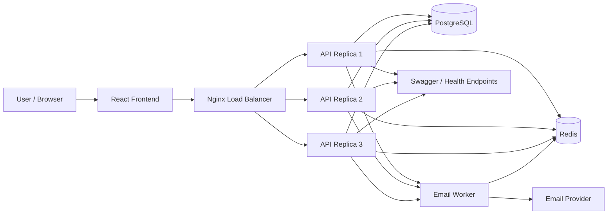

# Production-Style Scalable Authentication Platform

[](https://github.com/Akshat-shukla18/scalable-auth/actions/workflows/ci.yml)

An enterprise-grade, horizontally scalable authentication platform built with Node.js, Express, TypeScript, PostgreSQL, Redis, BullMQ, and React.

## CI Status

This project includes a GitHub Actions workflow that validates type-checking, build output, and tests on every push and pull request.

## Why this project exists

A simple auth app typically solves only one problem: "can a user sign up and log in?" That works for a toy project, but it breaks down quickly in real systems with traffic growth, security pressure, bot abuse, multiple app instances, and operational failures.

This project tackles the bigger engineering problem: building an authentication platform that remains secure, resilient, observable, and scalable as usage grows.

### What this system solves

- **Traffic spikes and scale-out**: It is designed to run behind a load balancer with multiple API replicas, instead of assuming a single Node process can handle everything.
- **Security at production depth**: Passwords are hashed with Argon2id, session refresh tokens rotate securely, and misuse patterns such as token replay or brute-force attempts are handled explicitly.
- **Abuse prevention**: Rate limiting is applied at distributed, shared-memory level so attackers cannot bypass protections by hitting one instance.
- **Reliability under load**: Email delivery, user notifications, and background work run in a queue instead of blocking web requests.
- **Operational visibility**: Health checks, telemetry, and API docs make it easier to observe and debug the system in production-like environments.
- **Resilience and recovery**: The architecture separates request handling from background jobs and makes failure handling a first-class concern.

### Why this is better than a simple auth flow

A basic login system usually includes:

- user table
- password hash
- login route
- JWT or session cookie
- maybe a reset-password flow

That is enough for demos, but it does not protect a real application from:

- credential stuffing and brute force attacks
- single-instance bottlenecks
- downtime during email or worker failures
- session replay and token misuse
- poor debugging when traffic increases or errors appear in production
- inability to scale horizontally without rework

This project adds an architecture designed for production:

- distributed rate limiting across instances
- rotating refresh tokens with reuse detection
- Redis-backed queue for background email jobs
- multi-container deployment and load balancing
- health checks and observability endpoints
- service separation between auth, API, and worker responsibilities

### Better than naive authentication in practice

| Basic auth app | This platform |
| --- | --- |
| One server process | Multiple replicas behind a load balancer |
| Local password hash only | Argon2id with production-grade security patterns |
| Direct email sending in request path | Async email queue with retry handling |
| Per-instance rate limiting | Distributed protection across nodes |
| One static token model | Refresh-token rotation and replay protection |
| Minimal visibility | Health checks, Swagger docs, telemetry |
| Demo-ready | Production-oriented and operationally safer |

## Architecture Overview

This project is structured as a production-style auth platform, not just a login screen.

- **API layer**: Express + TypeScript service that handles authentication, session management, and validation.
- **Worker layer**: Background jobs for email delivery and other asynchronous work, isolated from user-facing request latency.
- **Database layer**: PostgreSQL via Prisma for relational data such as users, sessions, and verification metadata.
- **Cache and queue layer**: Redis powers distributed rate limiting, token tracking, and BullMQ job queues.
- **Edge / load balancing**: Nginx sits in front of multiple API replicas to spread traffic and improve resilience.
- **Frontend app**: React client that demonstrates real auth flows such as register, login, OTP verification, reset password, and session state.

This separation matters because production auth systems need to survive traffic spikes, service failures, and security incidents without collapsing entire application behavior.



## Security model

The system is designed around common real-world security concerns rather than a simplistic token implementation.

- **Password hashing**: Argon2id is used for strong password storage with memory-hard protection.
- **Refresh-token rotation**: Refresh tokens rotate on use, reducing the impact of theft and improving session control.
- **Replay detection**: Reused refresh tokens are detected and invalidated, which helps prevent session hijacking patterns.
- **Rate limiting**: Requests are throttled per IP, account, and route using a shared Redis-backed mechanism.
- **HttpOnly cookies**: Sensitive session tokens are stored in secure cookies to reduce client-side exposure.
- **Background processing**: Email and notification work is decoupled from request paths to prevent user requests from being blocked by slow external systems.

This is one of the biggest differences between a basic auth implementation and a production-grade system: security is treated as a system-wide concern, not just a password check.

## Why this is enterprise-ready

This platform is better than a simple auth app because it addresses the engineering problems that appear when real users and real traffic arrive.

- It can scale horizontally without rewriting authentication logic.
- It resists abuse patterns such as brute force and credential stuffing.
- It keeps user-facing requests fast even when background jobs are delayed.
- It provides observability and operational health checks for debugging and monitoring.
- It handles session lifecycle and invalidation more safely than a static JWT-only setup.

In short: a simple auth app answers "can users log in?" This project answers "can this system stay secure, resilient, and scalable under real production conditions?"

## Key Features
- **Stateless Horizontal Scaling**: Multi-instance API cluster behind Nginx load balancer (`least_conn`).
- **Argon2id Password Security**: PHC-recommended memory-hard hashing with timing-safe comparisons.
- **Asynchronous Email Worker**: BullMQ + Redis queue with exponential backoff retries.
- **Distributed Rate Limiting**: Atomic sliding-window rate limiters per IP / Account / Route backed by Redis.
- **Rotating Refresh Token Sessions**: Single-use rotating refresh tokens stored in secure HttpOnly cookies with automatic reuse detection & family revocation.
- **Real-Time Observability**: Live system metrics telemetry, health probes (`/health`, `/ready`), and Swagger API documentation.


## Quick Start (Local Development)

### 1. Install Dependencies
```bash
npm install
```

### 2. Configure Environment
```bash
cp .env.example .env
```

### 3. Generate Prisma Client
```bash
npm run db:generate
```

### 4. Start Development Servers
```bash
# Start API server and Email Worker
npm run dev:api

# In a separate terminal, start React frontend
npm run dev:web
```

Open [http://localhost:3000](http://localhost:3000) to access the web application, or [http://localhost:4000/api/docs](http://localhost:4000/api/docs) for Swagger UI.

---

## Running with Docker Compose (Multi-Replica Cluster)

To spin up the full production cluster with **3 API replicas**, PostgreSQL, Redis, BullMQ Worker, React Web, and Nginx Load Balancer:

```bash
docker-compose up --build
```
Access the load balanced gateway at [http://localhost:8080](http://localhost:8080).

---

## Running Tests

```bash
# Run all unit and integration tests
npm test

# Run k6 load test benchmarks
npm run load-test
```
