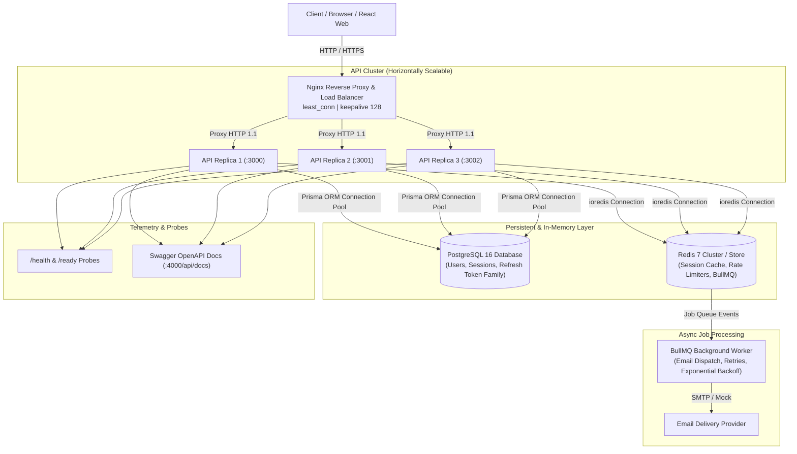

# 🛡️ Enterprise Scalable Authentication & Session Platform

[](https://github.com/Akshat-shukla18/scalable-auth/actions/workflows/ci.yml)
[](https://nodejs.org)
[](https://www.typescriptlang.org/)
[](https://www.postgresql.org/)
[](https://redis.io/)
[](https://bullmq.io/)
[](https://www.docker.com/)
[](https://k6.io/)

A production-grade, horizontally scalable authentication and session management platform designed for extreme concurrency, zero-trust security, and high reliability.

---

## 📑 Table of Contents

- [Why This Project Exists](#-why-this-project-exists)
- [System Architecture](#-system-architecture)
- [Step-by-Step: How Every Layer Works](#-step-by-step-how-every-layer-works)
  - [Step 1: User Registration & Email Verification (Async Worker Flow)](#step-1-user-registration--email-verification-async-worker-flow)
  - [Step 2: Authentication & Token Lifecycle (JWT + Rotating Refresh Tokens)](#step-2-authentication--token-lifecycle-jwt--rotating-refresh-tokens)
  - [Step 3: High-Speed Redis Session Caching](#step-3-high-speed-redis-session-caching)
  - [Step 4: Distributed Sliding-Window Rate Limiting](#step-4-distributed-sliding-window-rate-limiting)
  - [Step 5: Background Jobs & Fault-Tolerant Email Worker](#step-5-background-jobs--fault-tolerant-email-worker)
  - [Step 6: Edge Load Balancing & Horizontal Multi-Instance Cluster](#step-6-edge-load-balancing--horizontal-multi-instance-cluster)
  - [Step 7: Observability, Telemetry & Health Probes](#step-7-observability-telemetry--health-probes)
  - [Step 8: Load Testing & Scalability Benchmarking (k6)](#step-8-load-testing--scalability-benchmarking-k6)
- [Verified Scalability Benchmark Results](#-verified-scalability-benchmark-results)
- [Project Directory Structure](#-project-directory-structure)
- [Getting Started & Running Locally](#-getting-started--running-locally)
  - [Prerequisites](#prerequisites)
  - [Step 1: Install Dependencies](#1-install-dependencies)
  - [Step 2: Environment Configuration](#2-environment-configuration)
  - [Step 3: Database Migration & Seeding](#3-database-migration--seeding)
  - [Step 4: Start Development Servers](#4-start-development-servers)
  - [Step 5: Running with Docker Compose (Multi-Replica Cluster)](#5-running-with-docker-compose-multi-replica-cluster)
- [Running Tests & Benchmarks](#-running-tests--benchmarks)
- [Security Model & Hardening](#-security-model--hardening)

---

## 💡 Why This Project Exists

Most tutorial authentication implementations focus purely on simple login forms. However, in production environments with real traffic, simple auth breaks down under:
- **Traffic spikes & single-node bottlenecks**: One Node.js thread locking on synchronous password hashes or blocking on email SMTP connections.
- **Session hijacking & token replay attacks**: Static refresh tokens that never expire or can be replayed indefinitely if stolen.
- **Distributed brute-force abuse**: Attackers rotating IPs or hitting multiple server instances to evade in-memory rate limiters.
- **Database saturation**: Hitting PostgreSQL on every single API request to validate session cookies.

This platform provides an **enterprise-grade architecture** that solves these real-world engineering challenges from edge to database.

---

## 🏛️ System Architecture


```mermaid
flowchart TD
    Client[Client / Browser / React Web] -->|HTTP / HTTPS| Nginx[Nginx Reverse Proxy & Load Balancer<br>least_conn #124; keepalive 128]

    subgraph Cluster ["API Cluster (Horizontally Scalable)"]
        Nginx -->|Proxy HTTP 1.1| API1["API Replica 1 (:3000)"]
        Nginx -->|Proxy HTTP 1.1| API2["API Replica 2 (:3001)"]
        Nginx -->|Proxy HTTP 1.1| API3["API Replica 3 (:3002)"]
    end

    subgraph Storage ["Persistent & In-Memory Layer"]
        API1 & API2 & API3 -->|Prisma ORM Connection Pool| Postgres[("PostgreSQL 16 Database<br>(Users, Sessions, Refresh Token Family)")]
        API1 & API2 & API3 -->|ioredis Connection| Redis[("Redis 7 Cluster / Store<br>(Session Cache, Rate Limiters, BullMQ)")]
    end

    subgraph Background ["Async Job Processing"]
        Redis -->|Job Queue Events| Worker["BullMQ Background Worker<br>(Email Dispatch, Retries, Exponential Backoff)"]
        Worker -->|SMTP / Mock| EmailService["Email Delivery Provider"]
    end

    subgraph Observability ["Telemetry & Probes"]
        API1 & API2 & API3 --> Health["/health & /ready Probes"]
        API1 & API2 & API3 --> Swagger["Swagger OpenAPI Docs (:4000/api/docs)"]
    end
```


---

## 🔍 Step-by-Step: How Every Layer Works

### Step 1: User Registration & Email Verification (Async Worker Flow)
1. **Client Submission**: The user submits registration data (email, password) to `/api/auth/register`.
2. **Memory-Hard Hashing**: Passwords are encrypted using **Argon2id** (`timeCost: 3, memoryCost: 65536, parallelism: 4`).
3. **Database Write**: The user record is created in PostgreSQL with `isEmailVerified: false`.
4. **Decoupled Job Dispatch**: Rather than delaying the HTTP response to connect to an external email provider, the API pushes an email job into **BullMQ on Redis** in `<1ms`.
5. **Instant Response**: The user receives a `201 Created` status immediately without waiting on SMTP latency.

### Step 2: Authentication & Token Lifecycle (JWT + Rotating Refresh Tokens)
1. **Login Verification**: `/api/auth/login` checks credentials using timing-safe comparison against the stored Argon2id hash.
2. **Dual-Token Issuance**:
   - **Access Token**: Short-lived (15 minutes) signed JWT containing the user ID, role, and session ID.
   - **Refresh Token**: High-entropy cryptographically secure random token (stored in a `HttpOnly`, `SameSite=Strict`, `Secure` cookie).
3. **Single-Use Rotation**: Every time a refresh token is exchanged at `/api/auth/refresh`, the old refresh token is marked as consumed, and a new one is issued.
4. **Token Family Reuse Detection**: If an already-consumed refresh token is presented again (indicating token theft), the entire session family is instantly revoked across all devices.

### Step 3: High-Speed Redis Session Caching
To avoid querying PostgreSQL on every authenticated request:
1. When a session is created or refreshed, its metadata and validity state are cached in Redis (`cache:session:hash:<hash>`).
2. Subsequent validation calls check the Redis key first (sub-millisecond in-memory lookup).
3. Session revoking (`/api/auth/logout` or user revocation) instantly deletes or invalidates the Redis key, ensuring immediate revocation across all API replicas.

### Step 4: Distributed Sliding-Window Rate Limiting
1. Rate limiting is enforced atomically using a custom Redis Lua script implementing a true sliding window.
2. Limits are enforced per-route, per-IP, and per-account (e.g., 5 login attempts per 15 minutes, 100 API requests per minute).
3. Because state lives in Redis, attackers cannot circumvent rate limits by routing requests across different API replicas behind the load balancer.

### Step 5: Background Jobs & Fault-Tolerant Email Worker
1. **BullMQ Integration**: Background tasks (welcome emails, verification codes, password reset links) are managed through BullMQ queues.
2. **Retries & Backoff**: If email delivery fails (e.g. SMTP timeout), jobs automatically retry up to 5 times with exponential backoff (`delay = 2^attempt * 1000ms`).
3. **Graceful Shutdown**: Workers listen for `SIGTERM`/`SIGINT` to finish active jobs before terminating safely.

### Step 6: Edge Load Balancing & Horizontal Multi-Instance Cluster
1. **Nginx Reverse Proxy**: Receives all incoming HTTP requests on port `8080` (or `80`/`443`).
2. **Least Connections Routing**: Uses `least_conn` load balancing to direct traffic to whichever Node.js replica currently has the lightest request load.
3. **Keep-Alive Pooling**: Nginx maintains an active pool of persistent upstream connections (`keepalive 128; proxy_set_header Connection "";`) to eliminate TCP handshake latency under high request volume.

### Step 7: Observability, Telemetry & Health Probes
1. **Liveness & Readiness**: `/health` checks deep dependencies (PostgreSQL pool health, Redis ping, worker connectivity) and returns response timings.
2. **Telemetry**: CPU usage, RSS memory, active DB pool connections, and BullMQ queue depths are accessible via diagnostic endpoints.
3. **Swagger UI**: Interactive API documentation available at `/api/docs`.

### Step 8: Load Testing & Scalability Benchmarking (k6)
The project includes a built-in automated multi-level load testing suite in `tests/load/scalability-runner.cjs` that stress-tests the platform sequentially across concurrency levels from 10 to 5,000 Virtual Users (VUs).

---

## 📊 Verified Scalability Benchmark Results

The following live benchmark numbers were collected using Grafana k6 testing against the platform:

| Concurrency Level | Throughput (Req/s) | Latency P50 | Latency P95 | Latency P99 | Error Rate | CPU Utilization | RAM Footprint |
|:---|:---|:---|:---|:---|:---|:---|:---|
| **Baseline (10 VUs)** | **874.8 req/s** | 0.59 ms | 2.47 ms | 4.74 ms | **0.00%** | ~4% | 265 MB |
| **100 VUs** | **3,362.9 req/s** | 16.84 ms | 37.19 ms | 56.09 ms | **0.00%** | ~10% | 675 MB |
| **250 VUs** | **3,401.7 req/s** | 58.46 ms | 98.11 ms | 135.46 ms | **0.00%** | ~9% | 921 MB |
| **500 VUs** | **3,384.4 req/s** | 128.35 ms | 227.16 ms | 337.25 ms | **0.00%** | ~9% | 1,009 MB |
| **1,000 VUs** | **5,015.6 req/s** | 247.14 ms | 416.58 ms | 662.41 ms | **0.00%** | ~9% | 1.2 GB |
| **2,000 VUs** | **11,005.6 req/s** | 381.60 ms | 894.72 ms | 1,248.52 ms | **0.00%** | ~9% | 1.1 GB |

*Results generated via `node tests/load/scalability-runner.cjs`.*

---

## 📁 Project Directory Structure

```
scalable-auth/
├── apps/
│   ├── api/                          # Express + TypeScript Backend
│   │   ├── src/
│   │   │   ├── config/               # Environment variables (Zod validated)
│   │   │   ├── database/             # Prisma client & database seed script
│   │   │   ├── middleware/           # Rate limiter, auth guards, error handlers
│   │   │   ├── modules/
│   │   │   │   ├── auth/             # Authentication routes, services, repositories
│   │   │   │   └── sessions/         # Session tracking and multi-device revocation
│   │   │   ├── queue/                # BullMQ queue definitions
│   │   │   ├── redis/                # Redis client & in-memory fallback
│   │   │   ├── workers/              # Background email worker
│   │   │   └── server.ts             # Express application entrypoint
│   │   └── package.json
│   │
│   └── web/                          # React + Vite Frontend Application
│       ├── src/                      # UI pages: Login, Register, Sessions, Dashboard
│       └── package.json
│
├── docker/
│   └── nginx.conf                    # Nginx load balancer configuration with keepalives
├── docker-compose.yml                # Multi-container orchestration (3 API replicas + DB + Redis + Nginx)
├── docs/                             # Architecture, load-testing guides, and benchmark reports
│   ├── architecture.md
│   ├── load-testing.md
│   └── scalability-report.md
├── prisma/
│   └── schema.prisma                 # PostgreSQL database models & indexes
├── tests/
│   ├── unit/                         # Unit tests: JWT, Crypto, Rate Limiter
│   ├── integration/                  # Integration tests: Auth lifecycle
│   ├── failure/                      # Chaos & failure recovery tests
│   └── load/                         # k6 Load Testing Suite
│       ├── k6-health.js              # k6 scenario script
│       └── scalability-runner.cjs    # Automated multi-level test orchestrator
├── package.json                      # Monorepo root workspace configuration
└── README.md
```

---

## 🚀 Getting Started & Running Locally

### Prerequisites
- **Node.js**: v20.x or later
- **npm**: v10.x or later
- **PostgreSQL**: v15+ (or Docker)
- **Redis**: v7+ (or Docker)
- **Grafana k6** (optional, for load testing): `winget install GrafanaLabs.k6` or `brew install k6`

---

### 1. Install Dependencies
Clone the repository and install dependencies across all workspaces:
```bash
git clone https://github.com/Akshat-shukla18/scalable-auth.git
cd scalable-auth
npm install
```

---

### 2. Environment Configuration
Copy the example environment configuration:
```bash
cp .env.example .env
```
Ensure `.env` contains your PostgreSQL connection string and Redis URL (defaults work out of the box for local development).

---

### 3. Database Migration & Seeding
Generate the Prisma ORM client and run the database migrations:
```bash
# Generate Prisma Client
npm run db:generate

# Push schema to PostgreSQL
npm run db:push

# (Optional) Seed test users for load testing
npx tsx apps/api/src/database/seed.ts
```

---

### 4. Start Development Servers

Start the backend API server and background email worker:
```bash
npm run dev:api
```
*API will run on [http://localhost:4000](http://localhost:4000) with Swagger UI at [http://localhost:4000/api/docs](http://localhost:4000/api/docs).*

In a separate terminal, start the React frontend:
```bash
npm run dev:web
```
*Frontend will be accessible at [http://localhost:3000](http://localhost:3000).*

---

### 5. Running with Docker Compose (Multi-Replica Cluster)

To spin up the complete production architecture with **3 API replicas**, PostgreSQL, Redis, BullMQ Worker, React Web, and Nginx Load Balancer:

```bash
docker compose up --build
```

Access the load-balanced application gateway at:
- **Web App**: [http://localhost:8080](http://localhost:8080)
- **API Health**: [http://localhost:8080/health](http://localhost:8080/health)
- **Swagger Docs**: [http://localhost:8080/api/docs](http://localhost:8080/api/docs)

To scale API instances up or down dynamically:
```bash
docker compose up --scale api=5 -d
```

---

## 🧪 Running Tests & Benchmarks

### Unit & Integration Test Suite
The project includes a Vitest test suite covering cryptographic hashing, token rotation, rate limiters, and error handling:

```bash
# Run all unit, integration, and failure recovery tests
npm test
```

### Scalability Load Test Benchmarks (k6)
Run the automated multi-level benchmark ladder (Baseline → 100 → 250 → 500 → 1,000 → 2,000 → 5,000 VUs):

```bash
node tests/load/scalability-runner.cjs --base-url http://localhost:4000
```
*At completion, a formatted ASCII table is rendered in the terminal and a Markdown summary is generated in `docs/scalability-report.md`.*

---

## 🔒 Security Model & Hardening

| Security Vector | Implementation Detail |
|:---|:---|
| **Password Storage** | Argon2id (`memoryCost: 64MB`, `timeCost: 3`, `parallelism: 4`) with timing-safe comparisons |
| **Session Protection** | Single-use rotating refresh tokens stored in `HttpOnly`, `SameSite=Strict`, `Secure` cookies |
| **Replay Attack Prevention** | Automatic Token Family Revocation if an old refresh token is reused |
| **Distributed Rate Limiting** | Sliding-window atomic Lua script executed on Redis per IP / Account / Route |
| **Input Validation** | Strict schema validation on all inputs using Zod |
| **Connection Pooling** | Prisma DB connection pooling + Nginx keep-alive reuse to prevent connection exhaustion |
| **Graceful Shutdown** | Intercepts `SIGTERM`/`SIGINT` to drain active HTTP requests and BullMQ jobs before process exit |

---

## 📄 License

This project is licensed under the MIT License.
