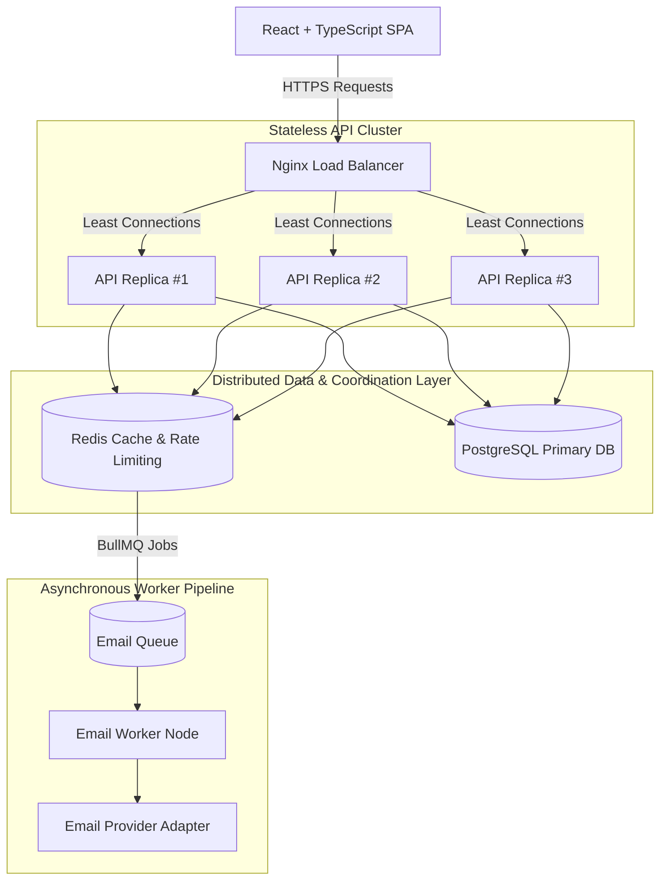

# System Architecture

The **Scalable Authentication Platform** is designed as a production-grade, horizontally scalable modular monolith. It provides enterprise-class security, sub-50ms API responses, and resilient asynchronous processing.

## 1. High-Level Architecture Diagram

## 2. Core Architectural Decisions

### Modular Monolith vs. Microservices
We intentionally structure the backend as a modular monolith (`Routes -> Controllers -> Services -> Repositories -> Database`) rather than prematurely introducing microservices:
1. **Zero RPC Overhead**: In-process method calls between auth, sessions, and system modules execute in microseconds.
2. **Simplified Transactions**: Cross-table atomic guarantees in PostgreSQL without requiring two-phase commits or saga orchestrators.
3. **Independent Worker Process**: The email queue consumer is decoupled into a dedicated worker process, preventing CPU-intensive or network-bound email operations from blocking HTTP request event loops.

### Stateless API Instances
Every API replica (`API #1`, `API #2`, `API #3`) is completely stateless:
- **No in-memory session stores**: Sessions are persisted in PostgreSQL; refresh tokens are hashed with SHA-256.
- **No in-memory rate limiters**: Rate limiting state is tracked across all nodes atomically using Redis sliding-window Lua scripts.
- **Any request can hit any node**: Load balancers use `least_conn` or round-robin without requiring sticky sessions.
