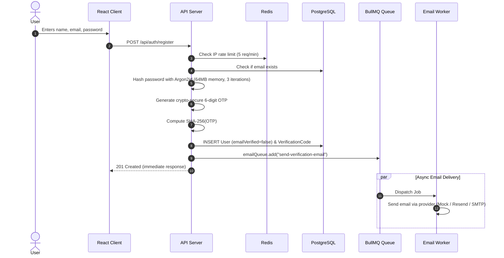
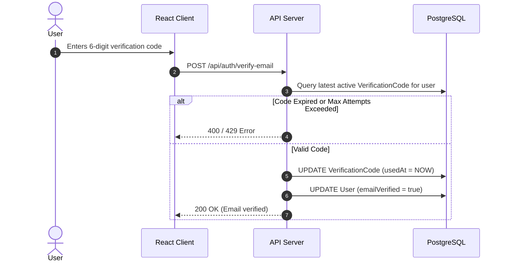
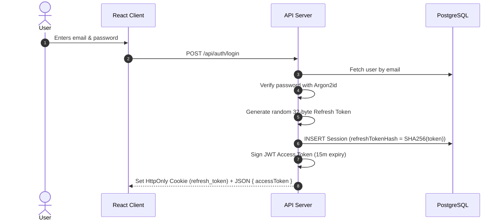
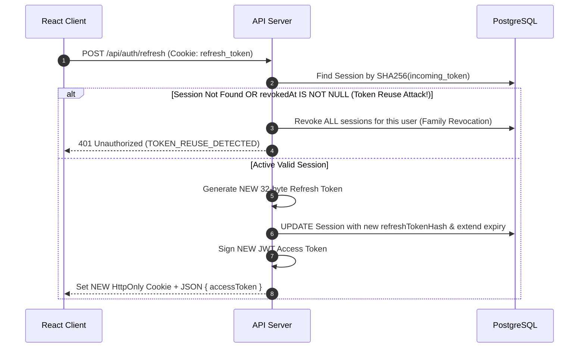

# Authentication Flow & Lifecycle

This document describes the end-to-end authentication lifecycles implemented in the platform.

## 1. Registration Flow

## 2. Email Verification Flow

## 3. Login & Session Issuance Flow

## 4. Refresh Token Rotation & Reuse Detection Flow

