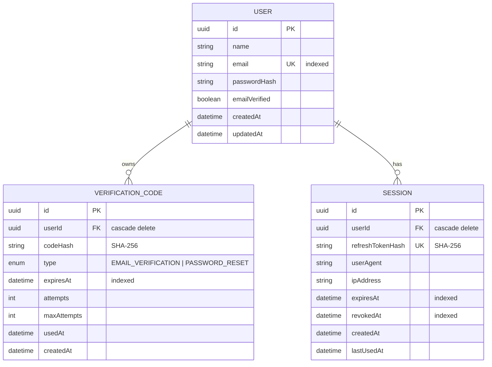

# Database Architecture & Schema

The database model is built with PostgreSQL and managed via Prisma ORM.

## 1. Entity Relationship Diagram

## 2. Index Strategy
- `User(email)`: Unique B-tree index for O(1) login and registration lookups.
- `Session(refreshTokenHash)`: Unique index for fast refresh token validation.
- `Session(userId, revokedAt)`: Compound index for efficient session listing and bulk revocation.
- `VerificationCode(userId, type, usedAt)`: Compound index to fetch active unexpired verification records.
