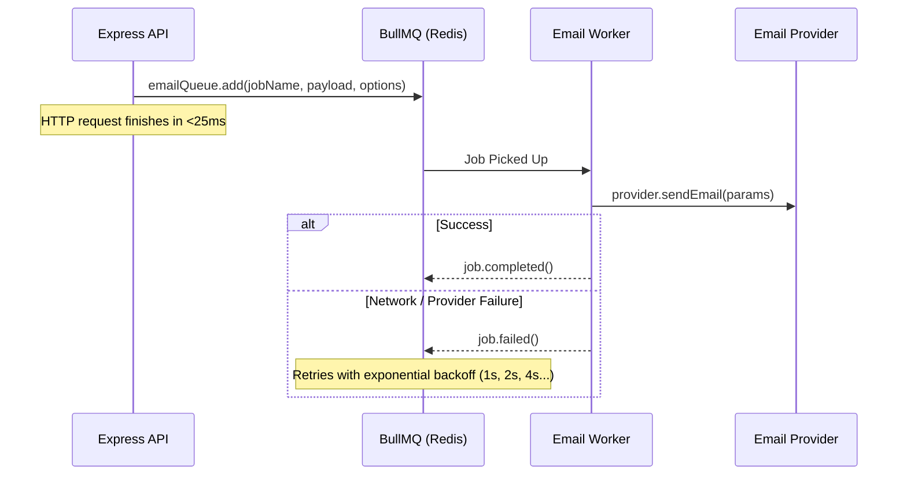

# Asynchronous Queue Pipeline (BullMQ)

## 1. Queue Architecture

## 2. Failure Handling & Resilience
- **Exponential Backoff**: Jobs are retried up to 3 times with exponential backoff starting at 1000ms.
- **Concurrency Controls**: Workers process up to 10 concurrent email deliveries with rate limiting (max 50 jobs/sec) to avoid provider rate limit throttling.
- **Dead-Letter Retention**: Failed jobs are kept for 24 hours for debugging and manual replay.
